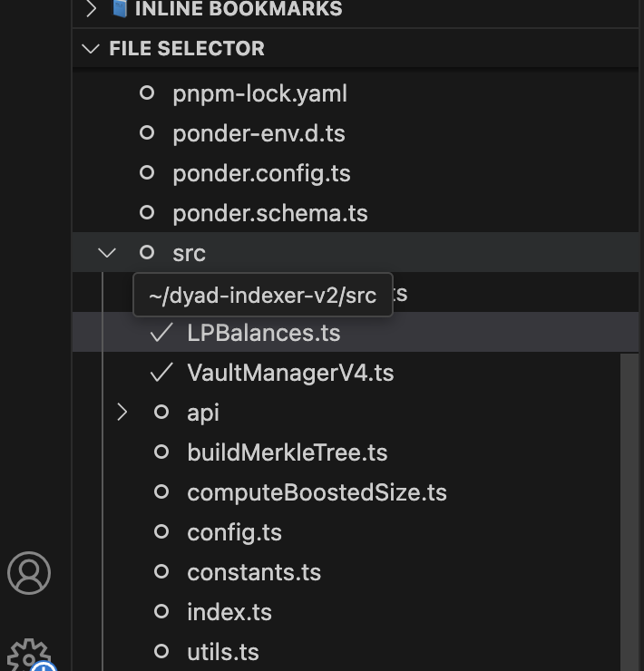

# shafupaste README

I built this for myself. So use accordingly bro.

### Why?

I wanna get the text of some files to copy/paste into chat-gpt directly. This works best for me. Not sure why. This extension gives you a list of all files that you can select from. You can also select entire directories.

Then run `> Gib Files` to copy the text inside all selected files into your clipboard.



### Installation

I'm not going through the marketplace bs to publish this in the extension store.

You will have to manually install this. Download the `shafupaste-0.0.1.vsix` file and run

```
> code --install-extension shafuPaste-0.1.0.vsix
```

